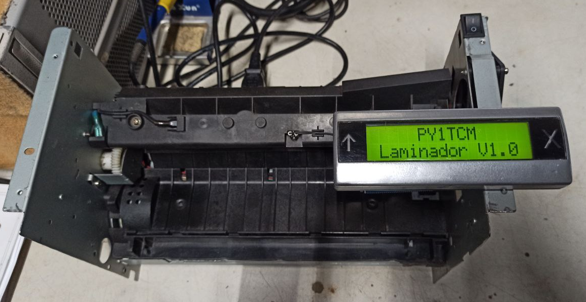

# PCB-Laminator

 Laminator for PCB fabrication

 Made from an old Lexmark E332 laser printer, to transfer toner to the plate for further corrosion.

 The fuser's thermistor itself and the fuser lamp drive circuit were used, the power supply board was cut to remove the part of the high voltage generation that is not needed and a step down was added for the atmega328's 5Vdc power supply.

 Photos and videos in the images folder.
 
 **Portuguese

 Laminador para fabricação de PCB
 
 Feito a partir de uma velha laser printer Lexmark E332, para transferência de toner a placa para posterior corrosão.
 
 Foi utilizado o próprio termistor existente no fusor e o circuito de acionamento da lâmpada do fusor, a placa da fonte foi cortada para retirar a parte da geração de alta tensão que não é necessária e adicionado um step down para alimentação de 5Vdc do atmega328.
 
 Fotos e vídeos na pasta images.
